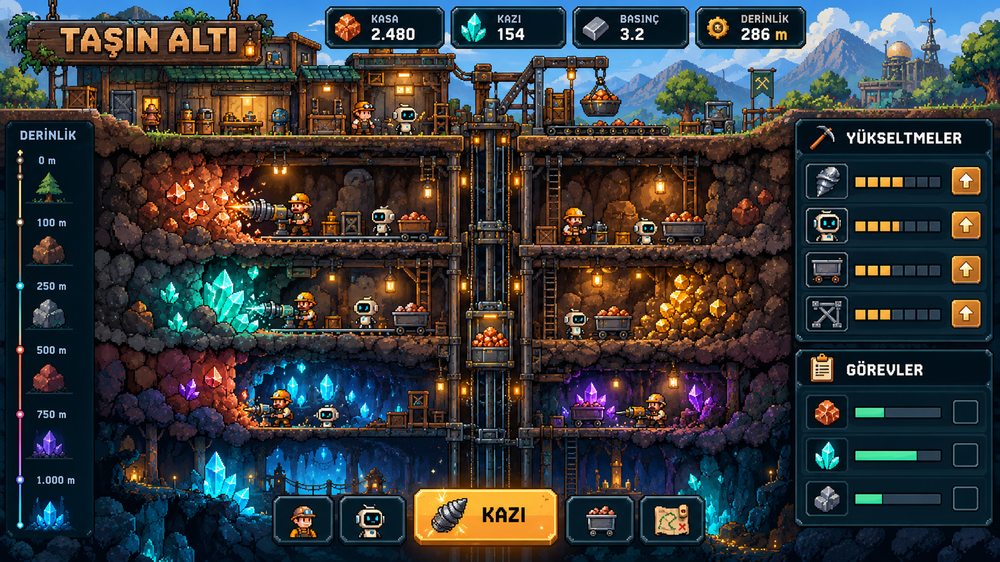
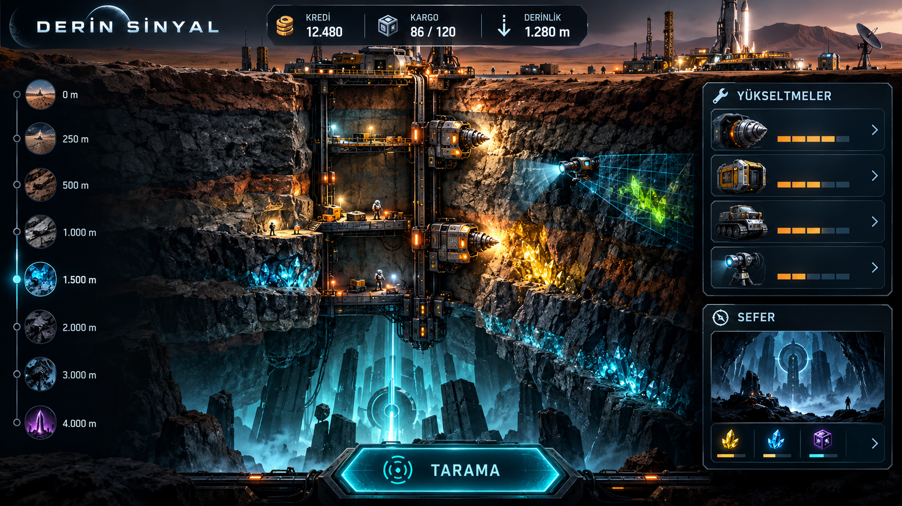
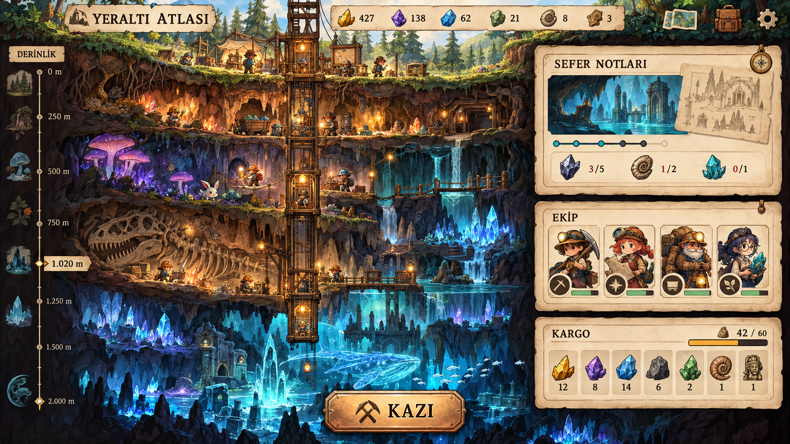

# Görsel Yön Seçenekleri

Üç konsept de aynı temel ekranı gösterir: derinlik katmanları, otomatik çalışan ekip, tıklanabilir keşifler, kaynak kapasitesi, yükseltmeler ve sefer/görev hedefleri.

## A — Taşın Altı

Sıcak, ayrıntılı piksel sanat; okunaklı kaynak sayaçları ve katman katman ilerleyen maden kesiti. Bu yön seçildi ve yüzeye altı tıklanabilir yapı eklenerek [güncel ana ekran](assets/concepts/tasin-alti-main-screen.png) hazırlandı. Yenilikçi aktif döngü: mineral damarlarını taramayla bulunan sırayla açınca zincirleme üretim bonusu veren “katman rezonansı”; oyuncu ekiplere kazı, taşıma ve ayıklama rolleri atar.

## B — Derin Sinyal

Koyu endüstriyel bilimkurgu; sondaj makineleri, tarama ışınları ve derin sefer hedefleri. Uygun yenilik adayı: ısı ve basınç pencerelerini sensörle okuyup doğru zamanda drone ve ekip yüklerini seçtiğimiz kısa sefer planlaması; risk, önceden görülebilir ve yönetilebilir olur.

## C — Yeraltı Atlası

El çizimi atlas ve boyalı mağara biyomları; keşif günlüğü, uzman ekip ve canlı çevre öne çıkar. Uygun yenilik adayı: mağara canlılarını ve ekosistemleri koruma ya da kaynak için dönüştürme kararları; her karar sonraki biyomları ve bulunan kaynakları etkiler.

Seçim sonrası tek seferde uygulanabilir ajan promptu, seçilen sanat yönüne göre tamamlanacak. Bu üç yenilik fikri şu aşamada seçenek önerileridir.
